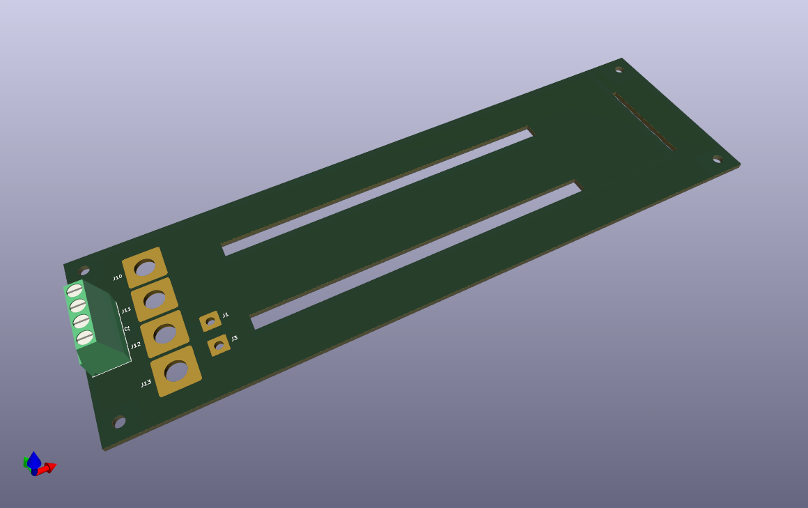
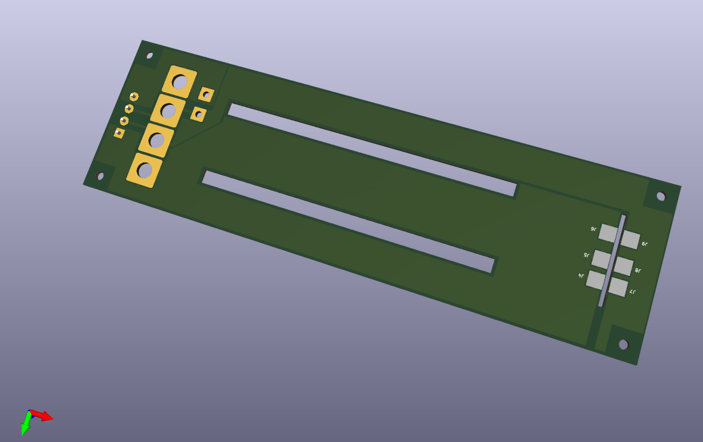
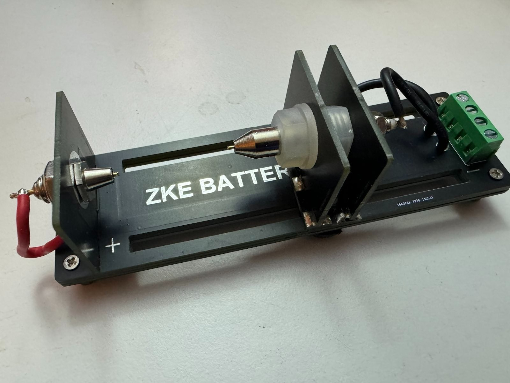
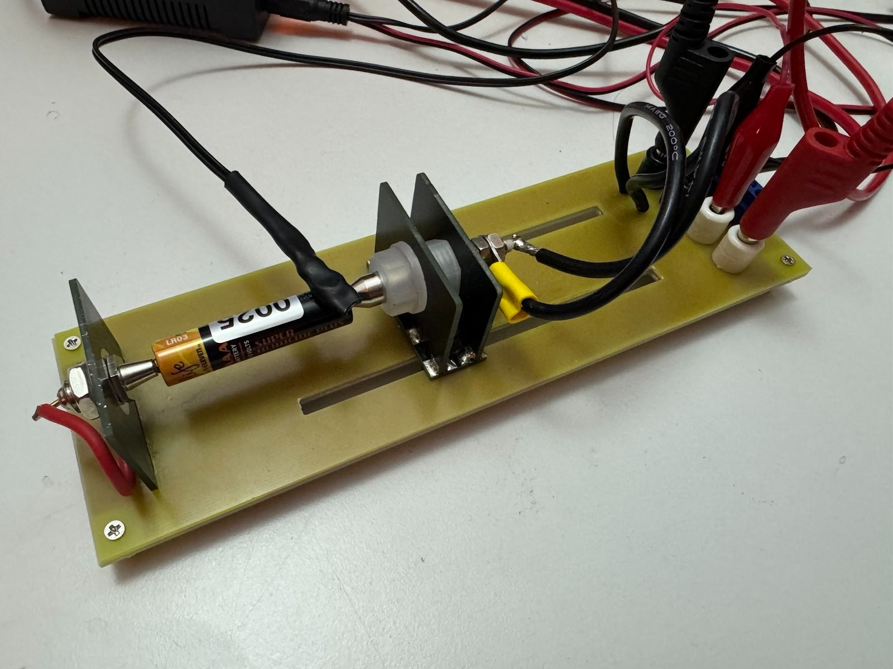

# batterytester_modification  

Own design to replace the PCB and the support material of a commercially available battery tester.  
The main PCB is made from 1.5mm FR4 material, the support underneath is 2mm FR4.  
The fixed probe PCB was desoldered and reused, the sliding probe assembly was also reused.  
All tested with 30A current, no excessive heat detected with thermal camera.  
  
Changes made compared to original tester:  
- Slots for sliding probe elongated to accept at least a 18650 comfortably and also button cells  
- Wider traces for higher testing current  
- Longer cables for sliding probe  
- Four big holes added to accept 4mm plugs  
  
  
  
  
  
  

